# Docker Reverse Proxy Architecture with Node.js

## Project Overview

This project demonstrates a **Two-Tier Architecture** using Docker, where **Nginx** acts as a reverse proxy and forwards incoming client requests to a **Node.js** application container. Both containers communicate over a custom Docker network, providing a clear separation between the web server and the application layer.

---

## Technologies Used

- Docker
- Dockerfile
- Nginx
- Node.js

---

## Project Structure

```text
Docker-Reverse-Proxy-Architecture-with-NodeJS/
│
├── nginx/
│   ├── Dockerfile
│   └── default.conf
│
├── node-app/
│   ├── Dockerfile
│   ├── app.js
│   └── package.json
│
└── README.md
```

---

## Prerequisites

Before getting started, ensure that you have the following:

- Docker installed
- A Linux EC2 instance (Amazon Linux/Ubuntu)
- Internet connectivity
- Port **80** allowed in the EC2 Security Group

Verify the Docker installation:

```bash
docker --version
```

---

## Step 1: Install Docker

Make sure Docker is installed on your system.

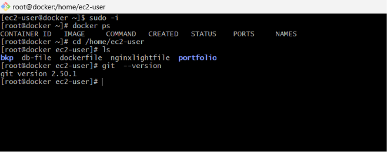

Clone the repository containing the Node.js application.

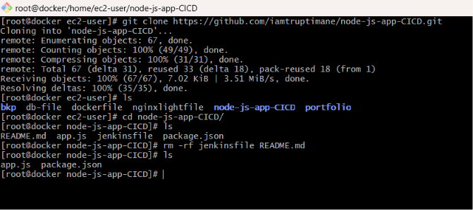

---

## Step 2: Create the Dockerfile

Create a Dockerfile.

```bash
vim Dockerfile
```

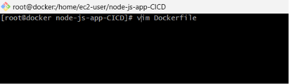

Add the required Dockerfile content.

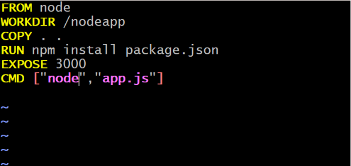

---

## Step 3: Build the Node.js Docker Image

```bash
docker build -t nodeimg .
```

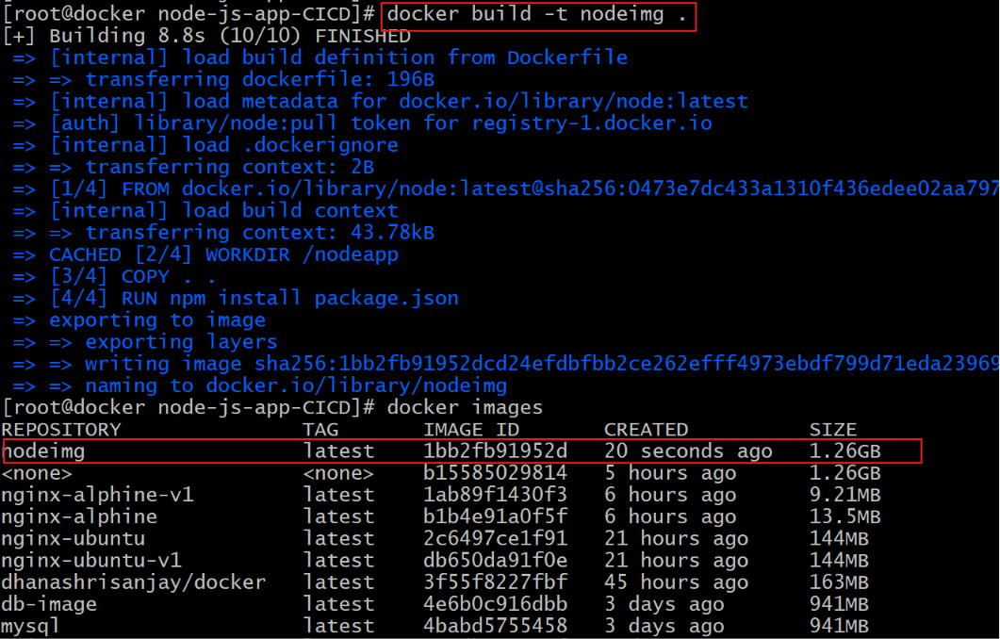

---

## Step 4: Run the Node.js Container

```bash
docker run -d --name nodeapp nodeimg
```

Verify that the container is running.

```bash
docker ps
```

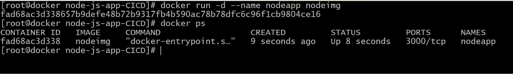

---

## Step 5: Run the Nginx Reverse Proxy Container

```bash
docker run -d -p 80:80 --name proxy --link nodeapp:nodeimg nginx
```

Verify that both containers are running.

```bash
docker ps
```

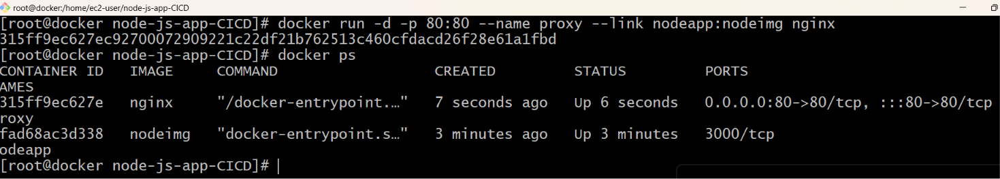

---

## Step 6: Configure the Nginx Container

Access the Nginx container.

```bash
docker exec -it proxy /bin/bash
```

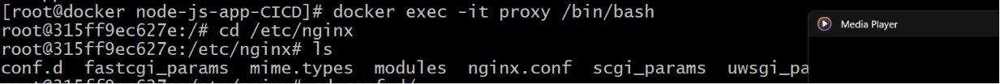

Navigate to the configuration directory.

```bash
cd /etc/nginx/conf.d
```

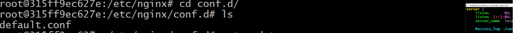

Install Vim inside the container.

```bash
apt update
apt install vim -y
```

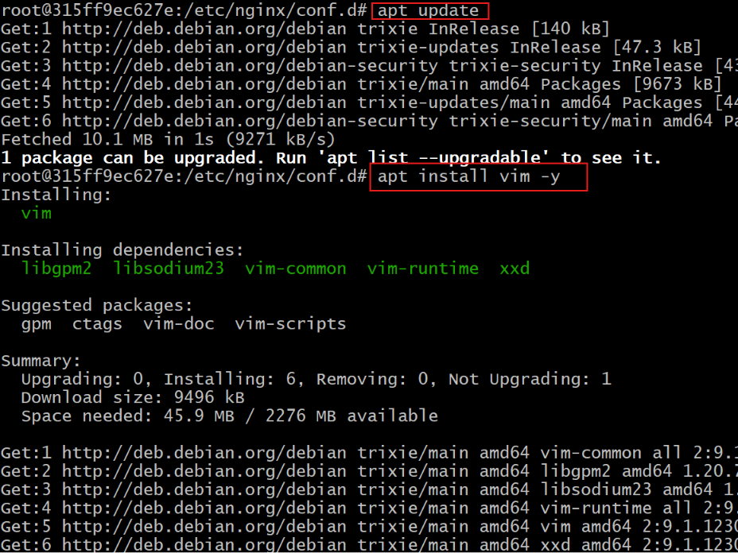

---

## Step 7: Configure the Reverse Proxy

Open the Nginx configuration file.

```bash
vim default.conf
```

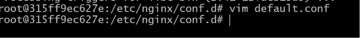

Add the following line inside the appropriate `location` block.

```nginx
proxy_pass http://nodeapp:3000;
```

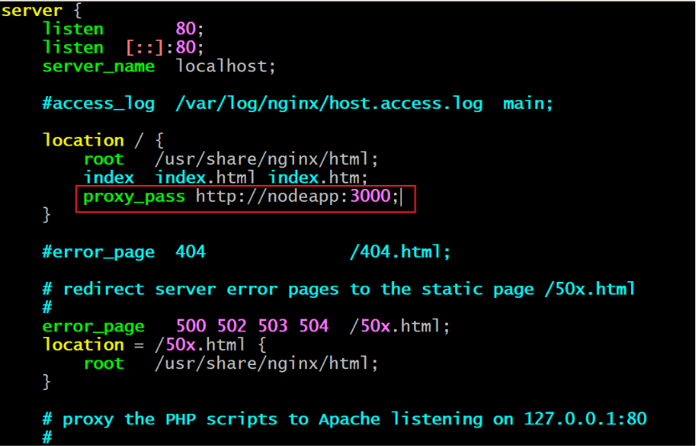

---

## Step 8: Restart the Nginx Container

Restart the proxy container to apply the configuration changes.

```bash
docker restart proxy
```

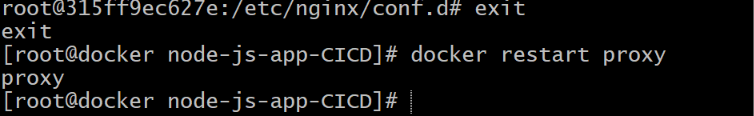

---

## Step 9: Test the Application

Open your browser and navigate to:

```text
http://<EC2-Public-IP>
```

You should see the Node.js application being served through the Nginx reverse proxy.

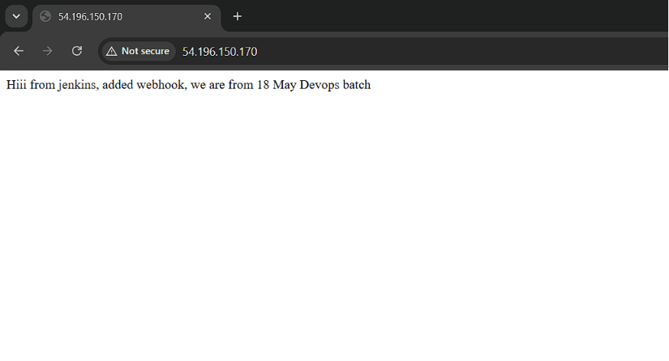

---

## Project Workflow

1. Build the Node.js Docker image.
2. Run the Node.js application container.
3. Run the Nginx reverse proxy container.
4. Configure Nginx to forward requests to the Node.js application.
5. Restart the Nginx container to apply the changes.
6. Access the application through the EC2 public IP.
7. Nginx forwards client requests to the Node.js application and returns the response.

---

## Author

**Dhanashri Chaudhari**

**DevOps Engineer | AWS | Docker | Terraform | Ansible**